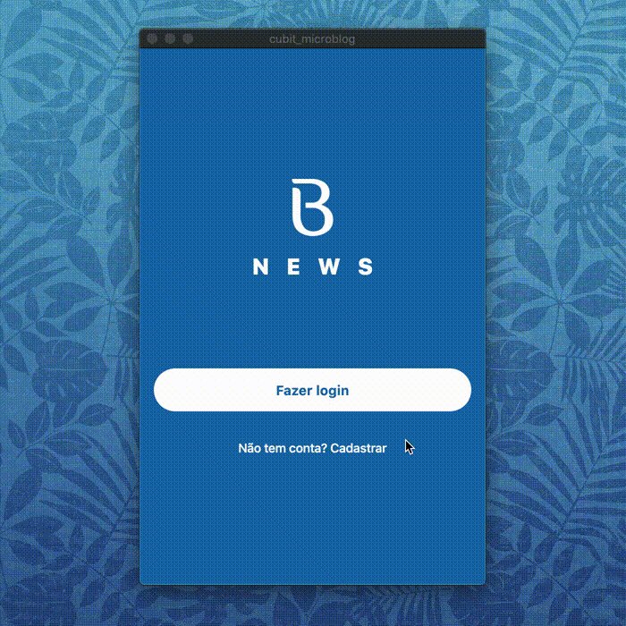

# Flutter Cubit Microblog 

[](https://travis-ci.com/murilosandiego/flutter-microblog) 
[](https://codecov.io/gh/murilosandiego/flutter-microblog)

|                       |
| :-------------------- |
|  |
|                       |

This application was developed using a well-defined and decoupled architecture, following TDD (test-driven programming) as a working methodology, Clean Architecture to make the distribution of responsibilities in layers, always following the SOLID principles and applying Design Patterns to solve some common problems. With the intention of practicing the teachings of the (Flutter, TDD, Clean Architecture, SOLID e Design Patterns) course taught by professor Rodrigo Manguinho.

## Roadmap

| Testing      | Progress |
| :--------- | :-------: |
| Unit       |    ✅     |
| Widgets    |    ✅     |
| Integration |   ☑️      |


## Libraries and Tools

- bloc 
- bloc_test 
- cupertino_icons 
- equatable 
- flutter_bloc 
- formz 
- http 
- intl
- shared_preferences 
- provider
- faker 
- mockito
## Testing

- Unit tests
- Cubit/Stream tests
- Widget Tests
- Navigation tests
- Form Validation tests
- Test Doubles
- Mocks
- Stubs
- Spies


# Clean Architecture


## Overview
A Flutter package that makes it easy and intuitive to implement [Uncle Bob's Clean Architecture](https://blog.cleancoder.com/uncle-bob/2012/08/13/the-clean-architecture.html) in Flutter. This package provides basic classes that are tuned to work with Flutter and are designed according to the Clean Architecture.

## Installation

### 1. Depend on It
Add this to your package's pubspec.yaml file:

```yaml

dependencies:
  flutter_clean_architecture: ^5.0.0

```

### 2. Install it
You can install packages from the command line:

with Flutter:

```shell
$ flutter packages get
```

Alternatively, your editor might support `flutter packages get`. Check the docs for your editor to learn more.

### 3. Import it
Now in your Dart code, you can use:

```dart
import 'package:flutter_clean_architecture/flutter_clean_architecture.dart';
```

## Flutter Clean Architecture Primer
### Introduction
It is architecture based on the book and blog by Uncle Bob. It is a combination of concepts taken from the Onion Architecture and other architectures. The main focus of the architecture is separation of concerns and scalability. It consists of four main modules: `App`, `Domain`, `Data`, and `Device`.

### The Dependency Rule
**Source code dependencies only point inwards**. This means inward modules are neither aware of nor dependent on outer modules. However, outer modules are both aware of and dependent on inner modules. Outer modules represent the mechanisms by which the business rules and policies (inner modules) operate. The more you move inward, the more abstraction is present. The outer you move the more concrete implementations are present. Inner modules are not aware of any classes, functions, names, libraries, etc.. present in the outer modules. They simply represent **rules** and are completely independent from the implementations.

### Layers

#### Domain
The `Domain` module defines the business logic of the application. It is a module that is independent from the development platform i.e. it is written purely in the programming language and does not contain any elements from the platform. In the case of `Flutter`, `Domain` would be written purely in `Dart` without any `Flutter` elements. The reason for that is that `Domain` should only be concerned with the business logic of the application, not with the implementation details. This also allows for easy migration between platforms, should any issues arise.

##### Contents of Domain
`Domain` is made up of several things.
* **Entities**
  * Enterprise-wide business rules
  * Made up of classes that can contain methods
  * Business objects of the application
  * Used application-wide
  * Least likely to change when something in the application changes
* **Usecases**
  * Application-specific business rules
  * Encapsulate all the usecases of the application
  * Orchestrate the flow of data throughout the app
  * Should not be affected by any UI changes whatsoever
  * Might change if the functionality and flow of application change
* **Repositories**
  * Abstract classes that define the expected functionality of outer layers
  * Are not aware of outer layers, simply define expected functionality
    * E.g. The `Login` usecase expects a `Repository` that has `login` functionality
  * Passed to `Usecases` from outer layers

`Domain` represents the inner-most layer. Therefore, it the most abstract layer in the architecture.

#### App
`App` is the layer outside `Domain`. `App` crosses the boundaries of the layers to communicate with `Domain`. However, the **Dependency Rule** is never violated. Using `polymorphism`, `App` communicates with `Domain` using inherited class: classes that implement or extend the `Repositories` present in the `Domain` layer. Since `polymorphism` is used, the `Repositories` passed to `Domain` still adhere to the **Dependency Rule** since as far as `Domain` is concerned, they are abstract. The implementation is hidden behind the `polymorphism`.

##### Contents of App
Since `App` is the presentation layer of the application, it is the most framework-dependent layer, as it contains the UI and the event handlers of the UI. For every page in the application, `App` defines at least 3 classes: a `Controller`, a `Presenter`, and a `View`.

* **View**
  * Represents only the UI of the page. The `View` builds the page's UI, styles it, and depends on the `Controller` to handle its events. The `View` **has-a** `Controller`.
  * In the case of Flutter
    * The `View` is comprised of 2 classes
      * One that extends `View`, which would be the root `Widget` representing the `View`
      * One that extends `ViewState` with the template specialization of the other class and its `Controller`. 
    * The `ViewState` contains the `view` getter, which is technically the UI implementation
    * `StatefulWidget` contains the `State` as per `Flutter`
    * The `StatefulWidget` only serves to pass arguments to the `State` from other pages such as a title etc.. It only instantiates the `State` object (the `ViewState`) and provides it with the `Controller` it needs through it's consumer.
    * The `StatefulWidget`  **has-a** `State` object (the `ViewState`) which **has-a** `Controller`
    * In summary, both the `StatefulWidget` and the `State` are represented by a  `View` and `ViewState` of the page.
    * The `ViewState` class maintains a `GlobalKey` that can be used as a key in its scaffold. If used, the `Controller` can easily access it via `getState()` in order to show snackbars and other dialogs. This is helpful but optional. 
* **Controller**
  * Every `ViewState` **has-a** `Controller`. The `Controller` provides the needed member data of the `ViewState` i.e. dynamic data. The `Controller` also implements the event-handlers of the `ViewState` widgets, but has no access to the `Widgets` themselves. The `ViewState` uses the `Controller`, not the other way around. When the `ViewState` calls a handler from the `Controller`, `refreshUI()` can be called to update the view.
  * Every `Controller` extends the `Controller` abstract class, which implements `WidgetsBindingObserver`. Every `Controller` class is responsible for handling lifecycle events for the `View` and can override:
    * **void onInActive()**
    * **void onPaused()** 
    * **void onResumed()** 
    * **void onDetached()**
    * **void onDisposed()**
    * **void onReassembled()**
    * **void onDidChangeDependencies()**
    * **void onInitState()**
    * etc..
  * Also, every `Controller` **has** to implement **initListeners()** that initializes the listeners for the `Presenter` for consistency.
  * The `Controller` **has-a** `Presenter`. The `Controller` will pass the `Repository` to the `Presenter`, which it communicate later with the `Usecase`. The `Controller` will specify what listeners the `Presenter` should call for all success and error events as mentioned previously. Only the `Controller` is allowed to obtain instances of a `Repository` from the `Data` or `Device` module in the outermost layer.
  * The `Controller` has access to the `ViewState` and can refresh the `ControlledWidgets` via `refreshUI()`.
* **Presenter**
  * Every `Controller` **has-a** `Presenter`. The `Presenter` communicates with the `Usecase` as mentioned at the beginning of the `App` layer. The `Presenter` will have members that are functions, which are optionally set by the `Controller` and will be called if set upon the `Usecase` sending back data, completing, or erroring.
  * The `Presenter` is comprised of two classes
    * `Presenter` e.g. `LoginPresenter`
      * Contains the event-handlers set by the `Controller`
      * Contains the `Usecase` to be used
      * Initializes and executes the usecase with the `Observer<T>` class and the appropriate arguments. E.g. with `username` and `password` in the case of a `LoginPresenter`
    * A class that implements `Observer<T>`
      * Has reference to the `Presenter` class. Ideally, this should be an inner class but `Dart` does not yet support them.
      * Implements 3 functions
        * **onNext(T)**
        * **onComplete()**
        * **onError()**
      * These 3 methods represent all possible outputs of the `Usecase`
        * If the `Usecase` returns an object, it will be passed to `onNext(T)`. 
        * If it errors, it will call `onError(e)`. 
        * Once it completes, it will call `onComplete()`. 
       * These methods will then call the corresponding methods of the `Presenter` that are set by the `Controller`. This way, the event is passed to the `Controller`, which can then manipulate data and update the `ViewState`
* Extra
  * `Utility` classes (any commonly used functions like timestamp getters etc..)
  * `Constants` classes (`const` strings for convenience)
  * `Navigator` (if needed)
  
#### Data
Represents the data-layer of the application. The `Data` module, which is a part of the outermost layer, is responsible for data retrieval. This can be in the form of API calls to a server, a local database, or even both. 

##### Contents of Data
* **Repositories**
  * Every `Repository` **should** implement `Repository` from the **Domain** layer.
  * Using `polymorphism`, these repositories from the data layer can be passed across the boundaries of layers, starting from the `View` down to the `Usecases` through the `Controller` and `Presenter`.
  * Retrieve data from databases or other methods. 
  * Responsible for any API calls and high-level data manipulation such as
    * Registering a user with a database
    * Uploading data
    * Downloading data
    * Handling local storage
    * Calling an API
* **Models** (not a must depending on the application)
  * Extensions of `Entities` with the addition of extra members that might be platform-dependent. For example, in the case of local databases, this can be manifested as an `isDeleted` or an `isDirty` entry in the local database. Such entries cannot be present in the `Entities` as that would violate the **Dependency Rule** since **Domain** should not be aware of the implementation.
  * In the case of our application, models in the `Data` layer will not be necessary as we do not have a local database. Therefore, it is unlikely that we will need extra entries in the `Entities` that are platform-dependent.
* **Mappers**
  * Map `Entity` objects to `Models` and vice-versa.
  * Static classes with static methods that receive either an `Entity` or a `Model` and return the other.
  * Only necessary in the presence of `Models`
* Extra
  * `Utility` classes if needed
  * `Constants` classes if needed

#### Device
Part of the outermost layer, `Device` communicates directly with the platform i.e. Android and iOS. `Device` is responsible for Native functionality such as `GPS` and other functionality present within the platform itself like the filesystem. `Device` calls all Native APIs. 

##### Contents of Data
* **Devices**
  * Similar to `Repositories` in `Data`, `Devices` are classes that communicate with a specific functionality in the platform.
  * Passed through the layers the same way `Repositories` are pass across the boundaries of the layer: using polymorphism between the `App` and `Domain` layer. That means the `Controller` passes it to the `Presenter` then the `Presenter` passes it polymorphically to the `Usecase`, which receives it as an abstract class.
* Extra
  * `Utility` classes if needed
  * `Constants` classes if needed
## Usage

### Folder structure

```
lib/
    app/                          <--- application layer
        pages/                        <-- pages or screens
          login/                        <-- some page in the app
            login_controller.dart         <-- login controller extends `Controller`
            login_presenter.dart          <-- login presenter extends `Presenter`
            login_view.dart               <-- login view, 2 classes extend `View` and `ViewState` resp.
        widgets/                      <-- custom widgets
        utils/                        <-- utility functions/classes/constants
        navigator.dart                <-- optional application navigator
    data/                         <--- data layer
        repositories/                 <-- repositories (retrieve data, heavy processing etc..)
          data_auth_repo.dart           <-- example repo: handles all authentication
        helpers/                      <-- any helpers e.g. http helper
        constants.dart                <-- constants such as API keys, routes, urls, etc..
    device/                       <--- device layer
        repositories/                 <--- repositories that communicate with the platform e.g. GPS
        utils/                        <--- any utility classes/functions
    domain/                       <--- domain layer (business and enterprise) PURE DART
        entities/                   <--- enterprise entities (core classes of the app)
          user.dart                   <-- example entity
          manager.dart                <-- example entity
        usecases/                   <--- business processes e.g. Login, Logout, GetUser, etc..
          login_usecase.dart          <-- example usecase extends `UseCase` or `CompletableUseCase`
        repositories/               <--- abstract classes that define functionality for data and device layers
    main.dart                     <--- entry point

```
